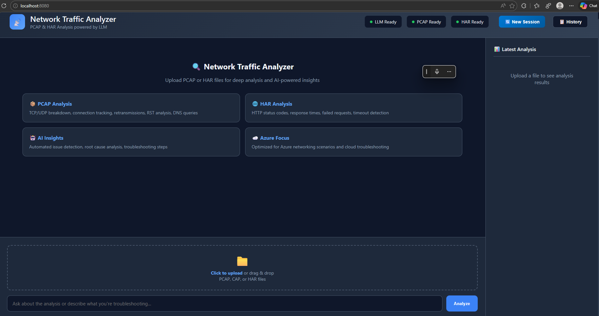
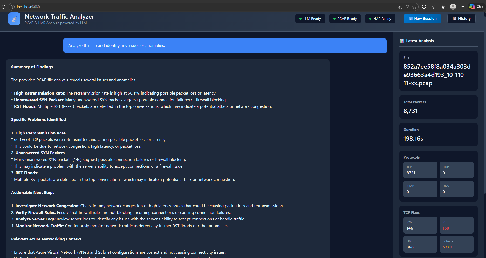
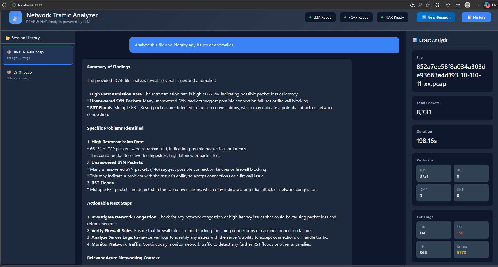

<div align="center">

# 🔍 AI Network Analyzer

**AI-Powered Network Traffic Analysis Tool — Built on Azure with Ollama + Llama 3.1**

[](https://python.org)
[](https://flask.palletsprojects.com)
[](https://ollama.com)
[](https://azure.microsoft.com)
[](LICENSE)

Upload a PCAP or HAR file → Get AI-powered network analysis & troubleshooting recommendations in seconds.

[Getting Started](#-getting-started) · [Features](#-features) · [Architecture](#-architecture) · [Documentation](#-documentation) · [Screenshots](#-screenshots)

</div>

---

## 💡 What Is This?

A self-hosted web application that analyzes network captures (PCAP/HAR files) using a **locally-running LLM** on an Azure GPU VM. No data leaves your infrastructure — the AI model runs entirely on your hardware.

Built for **network engineers and support teams** who need quick, AI-assisted analysis of packet captures and HTTP archive files without sending sensitive network data to third-party APIs.

### The Problem It Solves

| Traditional Approach | With AI Network Analyzer |
|---|---|
| Open Wireshark, manually inspect thousands of packets | Upload file, get instant AI summary of issues |
| Spend 30-60 min per PCAP file | Get analysis in 10-30 seconds |
| Need deep protocol expertise | AI explains findings in plain English |
| No automated anomaly detection | Flags retransmissions, RST floods, DNS failures automatically |
| Customer data sent to cloud AI APIs | **100% local** — data never leaves your VM |

---

## ✨ Features

### Core Analysis
- **PCAP Deep Packet Inspection** — Protocol distribution, TCP flag analysis, retransmission detection, DNS queries, top talkers by IP, anomaly flagging
- **HAR HTTP Analysis** — Status code breakdown, response time stats, domain analysis, content type distribution, slow request identification, error patterns
- **AI-Powered Insights** — LLM reads the parsed data and provides troubleshooting recommendations, root cause hypotheses, and next steps

### User Experience
- **Drag & Drop Upload** — Drop a `.pcap`, `.cap`, or `.har` file and click Analyze
- **Follow-up Questions** — Ask contextual questions about any analysis ("What's causing the retransmissions?", "Which IPs have the most traffic?")
- **Session History** — All sessions auto-save to disk. Reload any past analysis from the history sidebar
- **New Session** — Reset and start fresh with one click, no need to open a new browser tab
- **Real-time LLM Status** — Green badge confirms the model is loaded and GPU-accelerated
- **Dark Theme UI** — Clean, professional interface designed for extended use

### Security
- **Zero Public Web Ports** — The web UI is only accessible through an encrypted SSH tunnel
- **Local AI Model** — Meta Llama 3.1 runs on the VM's GPU; no external API calls, no data exfiltration
- **SSH-Only Access** — Port 22 is the only open port. All other ports are locked down at both VM and subnet NSG levels

---

## 🏗️ Architecture

```
┌──────────────────────────────────────────────────────────────┐
│  YOUR WORKSTATION                                            │
│                                                              │
│  Browser ──► http://localhost:8080                           │
│                    │                                         │
│              SSH Tunnel (encrypted)                          │
│                    │                                         │
└────────────────────┼─────────────────────────────────────────┘
                     │ Port 22 (only open port)
                     ▼
┌──────────────────────────────────────────────────────────────┐
│  AZURE GPU VM (Standard_NC4as_T4_v3)                         │
│  Ubuntu 24.04 LTS | Tesla T4 16GB VRAM                       │
│                                                              │
│  ┌─────────────────────────────────────────────────────────┐ │
│  │  Flask App (port 8080)              network_analyzer.py │ │
│  │  ├── Upload Handler (PCAP/HAR)                          │ │
│  │  ├── Scapy Parser (deep packet inspection)              │ │
│  │  ├── Haralyzer Parser (HTTP archive)                    │ │
│  │  ├── Session Manager (JSON persistence)                 │ │
│  │  └── LLM Client ──────────────────────┐                │ │
│  └───────────────────────────────────────┼─────────────────┘ │
│                                          │                    │
│  ┌───────────────────────────────────────▼─────────────────┐ │
│  │  Ollama (port 11434)                                    │ │
│  │  └── Llama 3.1 8B (Q4_K_M) ──► Tesla T4 GPU            │ │
│  └─────────────────────────────────────────────────────────┘ │
│                                                              │
│  /data/network-analyzer/                                     │
│  ├── network_analyzer.py    (single-file app, ~1700 lines)   │
│  └── sessions/              (persistent JSON session files)   │
└──────────────────────────────────────────────────────────────┘
```

---

## 🛠️ Tech Stack

| Component | Technology | Purpose |
|---|---|---|
| **Cloud Platform** | Microsoft Azure | GPU VM hosting (NC4as_T4_v3) |
| **GPU** | NVIDIA Tesla T4 (16 GB VRAM) | LLM inference acceleration |
| **OS** | Ubuntu 24.04 LTS | Server operating system |
| **LLM Runtime** | [Ollama](https://ollama.com) 0.16 | Serves the AI model locally |
| **AI Model** | [Meta Llama 3.1 8B](https://llama.meta.com/) | Open-source LLM for analysis (Q4_K_M quantization) |
| **Backend** | Python 3.12 + [Flask](https://flask.palletsprojects.com) 3.1 | Web server & API |
| **PCAP Parsing** | [Scapy](https://scapy.net) 2.7 | Deep packet inspection |
| **HAR Parsing** | [Haralyzer](https://github.com/haralyzer/haralyzer) 2.4 | HTTP Archive analysis |
| **Frontend** | Vanilla HTML/CSS/JS (inline) | No build tools, no npm, no frameworks |
| **Access Method** | SSH Tunnel via Azure CLI | Encrypted access, zero public web ports |
| **Service Manager** | systemd | Auto-start, crash recovery |
| **Session Storage** | JSON files on disk | Persistent analysis history |
| **Development** | VS Code + GitHub Copilot (Claude) | AI-assisted development |

---

## 🚀 Getting Started

### Prerequisites

- **Azure subscription** with GPU VM quota (NC-series)
- **Azure CLI** installed and authenticated (`az login`)
- **Python 3.10+** (on VM)
- **SSH key pair** for tunnel access

### Quick Deploy (3 Steps)

**Step 1: Create Azure GPU VM**

```powershell
# Create resource group
az group create --name <YOUR-RESOURCE-GROUP> --location southcentralus

# Create GPU VM
az vm create \
  --resource-group <YOUR-RESOURCE-GROUP> \
  --name <YOUR-VM-NAME> \
  --size Standard_NC4as_T4_v3 \
  --image Ubuntu2404 \
  --admin-username <YOUR-USERNAME> \
  --generate-ssh-keys \
  --os-disk-size-gb 64 \
  --data-disk-sizes-gb 256
```

> See [docs/02_VM_SETUP.md](docs/02_VM_SETUP.md) for the complete step-by-step VM setup.

**Step 2: Install Ollama + App on VM**

```bash
# SSH into your VM, then:
curl -fsSL https://ollama.com/install.sh | sh     # Install Ollama
ollama pull llama3.1                                # Download the model (~4.9 GB)
pip3 install flask scapy haralyzer requests         # Python dependencies

# Copy network_analyzer.py to /data/network-analyzer/ and start the service
# See docs/04_APP_DEPLOYMENT.md for full deployment instructions
```

**Step 3: Connect via SSH Tunnel**

```powershell
# Start SSH tunnel (keep this terminal open)
az ssh vm --resource-group <YOUR-RESOURCE-GROUP> --name <YOUR-VM-NAME> \
  --local-user <YOUR-USERNAME> -- -L 8080:localhost:8080 -N
```

Then open **http://localhost:8080** in your browser. That's it!

---

## 📖 Documentation

Comprehensive guides for every aspect of the project:

| Guide | Description |
|---|---|
| [01 — Quick Start](docs/01_QUICK_START.md) | Connect and analyze your first file in 2 minutes |
| [02 — VM Setup](docs/02_VM_SETUP.md) | Full Azure GPU VM setup from scratch |
| [03 — Ollama Setup](docs/03_OLLAMA_SETUP.md) | Ollama installation, model management, GPU config |
| [04 — App Deployment](docs/04_APP_DEPLOYMENT.md) | Deploy/update the application |
| [05 — Adding Features](docs/05_ADDING_FEATURES.md) | Code architecture & how to extend the analyzer |
| [06 — Networking & NSG](docs/06_NETWORKING_NSG.md) | SSH tunnel setup, NSG lockdown, security model |
| [07 — Scaling](docs/07_SCALING_PRODUCTION.md) | Scale to more users, production hardening |
| [08 — Troubleshooting](docs/08_TROUBLESHOOTING.md) | Common issues and fixes |
| [09 — Cost & Budget](docs/09_COST_BUDGET.md) | Cost breakdown, Spot VMs, budget planning |

---

## 📸 Screenshots

### Main Interface


### PCAP Analysis Results


### Session History


---

## 📂 Project Structure

```
ai-network-analyzer/
├── README.md                    # This file
├── LICENSE                      # MIT License
├── CONTRIBUTING.md              # Contribution guidelines
├── .gitignore                   # Git ignore rules
│
├── src/
│   └── network_analyzer.py     # Main application (~1700 lines, single-file Flask app)
│
├── docs/                        # Setup & operations guides
│   ├── 01_QUICK_START.md
│   ├── 02_VM_SETUP.md
│   ├── 03_OLLAMA_SETUP.md
│   ├── 04_APP_DEPLOYMENT.md
│   ├── 05_ADDING_FEATURES.md
│   ├── 06_NETWORKING_NSG.md
│   ├── 07_SCALING_PRODUCTION.md
│   ├── 08_TROUBLESHOOTING.md
│   └── 09_COST_BUDGET.md
│
└── assets/                      # Screenshots and images (add your own)
    └── .gitkeep
```

---

## 🔐 Security Model

This application was designed with a **zero-trust, defense-in-depth** approach:

| Layer | Implementation |
|---|---|
| **Network** | Only port 22 (SSH) is open. No web ports exposed. Dual NSG enforcement (VM + subnet level). |
| **Access** | Users must establish an SSH tunnel to reach the web UI. No credentials are stored in the app. |
| **Data Privacy** | PCAP/HAR files contain sensitive network data (IPs, hostnames, payloads). All processing happens locally on the VM — nothing is sent to external APIs. |
| **AI Model** | Meta Llama 3.1 is open-source and runs entirely on the VM's GPU via Ollama. No cloud AI services involved. |
| **Encryption** | All traffic between user and application travels through the SSH tunnel (AES-256 encrypted). |

---

## 💰 Cost

| Component | Monthly (Spot VM) | Monthly (Regular VM) |
|---|---|---|
| GPU VM (NC4as_T4_v3) | ~$52-$158 | ~$526 |
| OS + Data Disk | ~$34 | ~$34 |
| Public IP | ~$4 | ~$4 |
| Ollama + Llama 3.1 | **$0** (open-source) | **$0** |
| LLM API calls | **$0** (local inference) | **$0** |
| **Total** | **~$90-$196** | **~$564** |

> 💡 **Key advantage:** Unlimited AI analysis queries at a flat infrastructure cost. No per-token billing. Compare to Azure OpenAI GPT-4 which costs ~$0.03-0.10 per query.

See [docs/09_COST_BUDGET.md](docs/09_COST_BUDGET.md) for detailed scaling projections and budget planning.

---

## 🤝 Contributing

See [CONTRIBUTING.md](CONTRIBUTING.md) for guidelines. Pull requests and feature suggestions are welcome!

### Ideas for Future Enhancement
- [ ] TLS/SSL certificate analysis
- [ ] QUIC protocol support
- [ ] Multi-user authentication (Azure AD)
- [ ] Larger LLM model support (70B with multi-GPU)
- [ ] Automated report generation (PDF export)
- [ ] Wireshark filter suggestions
- [ ] REST API mode (headless analysis)

---

## 📄 License

This project is licensed under the MIT License — see [LICENSE](LICENSE) for details.

---

## 🙏 Acknowledgments

- **[Meta AI](https://llama.meta.com/)** — Llama 3.1 open-source LLM
- **[Ollama](https://ollama.com)** — Local LLM runtime that makes self-hosted AI accessible
- **[Scapy](https://scapy.net)** — Powerful Python packet manipulation library
- **[Flask](https://flask.palletsprojects.com)** — Lightweight Python web framework
- **[GitHub Copilot](https://github.com/features/copilot)** — AI-assisted development used throughout this project

---

<div align="center">

*If this project helps you, consider giving it a ⭐!*

</div>
